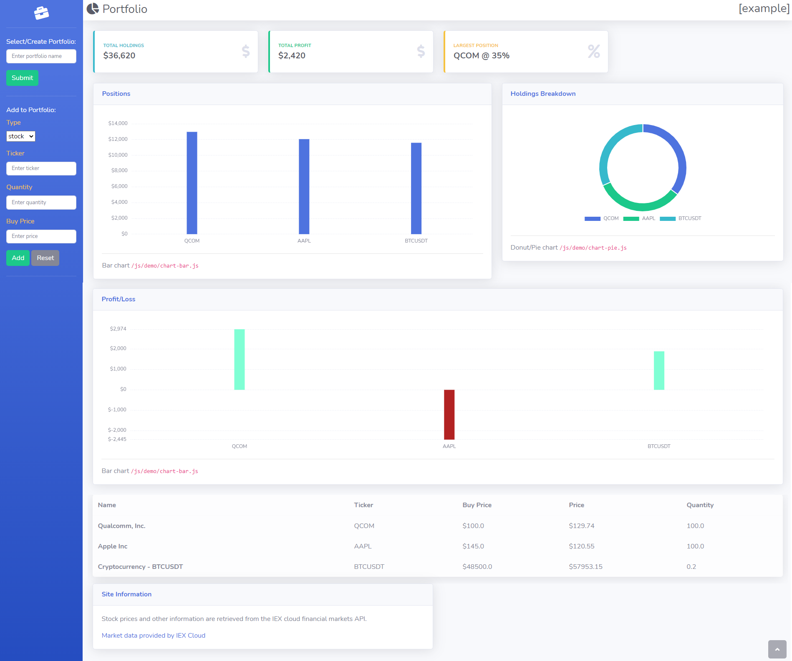

# Financial Portfolio Application

> A personal project which aims to create a simple but effective application  
> which enables a user to create a portfolio of their financial assets,  
> including  Stocks, Cryptocurrencies and Commodities.  
> A dashboard will present the user with an informative overview of their current holdings,  
> in the form of charts, tables and metrics.  
>
> All market data is provided by [IEX Cloud](https://iexcloud.io/docs/api/).

> Sample Portfolio:  
> https://briefcase-app.herokuapp.com/api/v1/portfolio?name=example  
> (allow some time for loading)
> 
> Project Issues:  
> https://github.com/soca-git/briefcase/issues
> 
> Project Board:  
> https://github.com/soca-git/briefcase/projects/1

## Technologies

> * Java
> * Maven
> * Spring/Spring Boot
> * Spring Data JPA
> * Postgres
> * [iextrading4j](https://github.com/WojciechZankowski/iextrading4j)
> * IEX Cloud API
> * Heroku
> * Git/GitHub
> * Git Actions
> * HTML/CSS
> * JavaScript
> * Bootstrap 4
> * ChartJS
