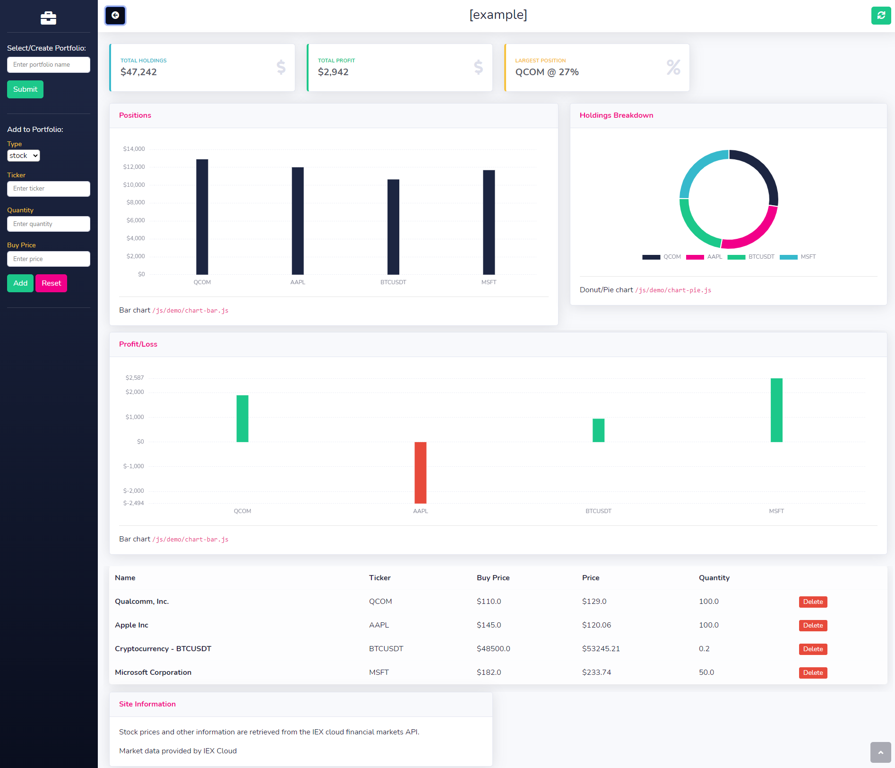

# Financial Portfolio Application

> A personal project which aims to create a simple but effective application  
> which enables a user to create a portfolio of their financial assets,  
> including  Stocks, Cryptocurrencies and Commodities.  
> A dashboard will present the user with an informative overview of their current holdings,  
> in the form of charts, tables and metrics.  

> All market data is provided by [IEX Cloud](https://iexcloud.io/docs/api/).
> 
> Sample Portfolio:  
> https://briefcase-app.herokuapp.com/api/v1/portfolio?name=example  
> (allow some time for loading)

## Application Features

- [x] Create Portfolio.
- [x] Add stock quantity using ticker symbol.
- [x] Add crypto quantity using ticker symbol.
- [ ] Add commodity quantity using ticker symbol.
- [x] Create Client for IEX Cloud interactions.
- [x] Initial metrics.
- [x] Initial charts.
- [x] Portfolio items table.
- [x] Add ability to supply purchase price of item.
- [x] Add profit/loss related metrics.
- [ ] Add available ticker symbol index/search.
- [ ] Add ability to update/refresh market prices.
- [x] Add ability to remove items from portfolio.

## Project Milestones

- [x] Study/research Spring framework.
- [x] Implement Demo Application using Spring framework.
- [x] Implement version control through Git/GitHub.
- [ ] Create project issues on GitHub to manage project timeline.
- [x] Deploy Application to Heroku.
- [ ] Implement Test Suite for backend using JUnit.
- [ ] Study/research CI/CD.
- [ ] Implement CI/CD pipeline.
- [ ] Investigate front-end framework/libraries.
- [ ] Mobile friendly.

## Technologies

> * Java
> * Maven
> * Spring/Spring Boot
> * Spring Data JPA
> * PostgeSQL
> * [iextrading4j](https://github.com/WojciechZankowski/iextrading4j)
> * IEX Cloud API
> * Heroku
> * Git/GitHub

> * HTML/CSS
> * JavaScript
> * Bootstrap 4
> * ChartJS
